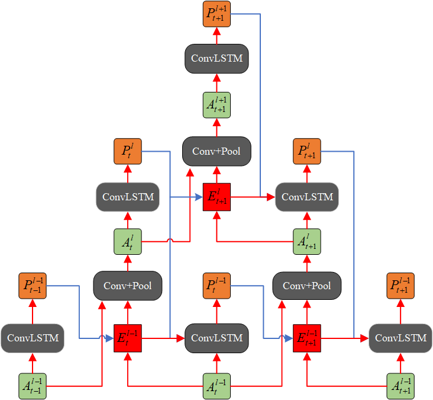

# PPNet

## A Pyramidal Predictive Network for Video Prediction Base on Predictive Coding Theory

Inspired by the well-known predictive coding theory in cognitive science, we propose a novel neural network model for the task of visual-frame prediction. In this paper, our main work is to combine the theoretical framework of predictive coding and deep learning architectures, to design an efficient predictive network model for visual-frame prediction. The model is composed of a series of recurrent and convolutional units forming the top-down and bottom-up streams, respectively. It learns to predict future frames in a visual sequence, with ConvLSTMs on each layer in the network making local prediction from top to down. The main innovation of our model is that the update frequency of neural units on each of the layer decreases with the increasing of network levels, which results in the model appears like a pyramid from the perspective of time dimension, so we call it the Pyramid Predictive Network (PPNet). Particularly, this pyramid-like design is consistent to the neuronal activities in the neuroscience findings involved in the predictive coding framework. According to the experimental results, this model shows better compactness and comparable predictive performance with existing works, implying lower computational cost and higher prediction accuracy.
